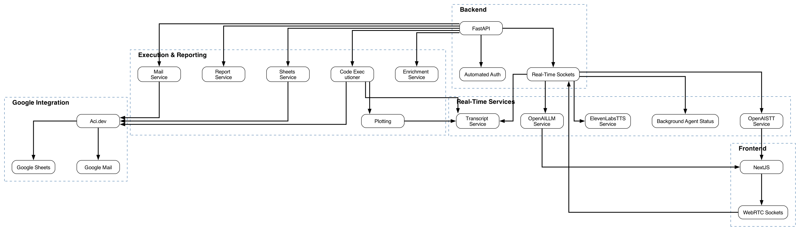

# yDE Your Data Expert

**Voice-Powered AI Data Analysis Platform**

yDE (Your Data Expert) is an innovative voice agent platform that transforms data analysis through natural conversation. Upload your datasets and have intelligent conversations with an AI analyst that can understand, analyze, and provide insights through voice interaction.


## 🚀 Features
- Your personal Live Data Voice Agent
- CSV-Upload (could be any size)
- Live Transcript, graph visualization, code and results streaming to frontend
- Code Execution for insights
- Defer Data Enrichment Task to the background with live updating Google Sheets and streaming to UI/Agent (currently requires ACI_API_KEY to handle auth with Google Sheets)

(if no ACI_API_KEY it still works, by live updating a pd df and saving to disk)
### Technology Stack

**Frontend:**
- Next.js 15.4.2 with React 19
- TypeScript for type safety
- Tailwind CSS for styling
- Pipecat for WebRTC audio handling
- Motion for animations

**Backend:**
- FastAPI for RESTful API
- Pipecat AI for voice processing pipeline
- WebRTC for real-time audio communication
- Pandas for data manipulation
- OpenAI GPT-4 for natural language processing
- ElevenLabs for text-to-speech synthesis
- aci.dev integration for gmail, google sheets

## 🛠️ Installation & Setup

### Prerequisites

- Python 3.8+
- Node.js 18+
- npm or yarn
- Modern web browser with WebRTC support

### Quick Start
1. **Clone the repository**
   ```bash
   git clone <repository-url>
   cd my-analyst-hack
   ```

2. **Run the startup script**
   ```bash
   chmod +x start.sh
   ./start.sh
   ```

   This script will:
   - Check prerequisites
   - Set up Python virtual environment
   - Install dependencies
   - Start both backend and frontend servers

3. **Access the application**
   - Frontend: http://localhost:3000
   - Backend API: http://localhost:7860
   - API Documentation: http://localhost:7860/docs

### Manual Setup

#### Backend Setup

1. **Navigate to backend directory**
   ```bash
   cd backend
   ```

2. **Create virtual environment**
   ```bash
   python3 -m venv venv
   source venv/bin/activate  # On Windows: venv\Scripts\activate
   ```

3. **Install dependencies**
   ```bash
   pip install -r requirements.txt
   ```

4. **Configure environment variables**
   ```bash
   cp .env.example .env
   ```
   
   Edit `.env` file with your API keys:
   ```env
   ELEVENLABS_API_KEY=your_elevenlabs_api_key
   OPENAI_API_KEY=your_openai_api_key
   ELEVENLABS_VOICE_ID=your_preferred_voice_id
   ACI_API_KEY=(optional) your-aci-dev-api-key
   ```
   (if no ACI_API_KEY it still works, by live updating a pd df and saving to disk)


5. **Start the backend server**
   ```bash
   python main.py
   ```

#### Frontend Setup

1. **Navigate to frontend directory**
   ```bash
   cd frontend
   ```

2. **Install dependencies**
   ```bash
   npm install
   ```

3. **Start the development server**
   ```bash
   npm run dev
   ```

## 🔑 API Keys Setup

### OpenAI API Key
1. Visit [OpenAI Platform](https://platform.openai.com/)
2. Create an account or sign in
3. Navigate to API Keys section
4. Create a new API key
5. Add to your `.env` file

### ElevenLabs API Key
1. Visit [ElevenLabs](https://elevenlabs.io/)
2. Create an account or sign in
3. Go to Profile Settings
4. Copy your API key
5. Add to your `.env` file

### Google Sheets Integration (Optional)
For Google Sheets export functionality:
1. Set up Google Cloud Project
2. Enable Google Sheets API
3. Create service account credentials
4. Add credentials to backend configuration

## 📖 Usage Guide

### Getting Started

1. **Upload Your Dataset**
   - Click "Upload Dataset" on the home screen
   - Select a CSV file from your computer
   - The system will generate a unique session ID

2. **Start Voice Conversation**
   - Click "Connect" to establish voice connection
   - Grant microphone permissions when prompted
   - Begin speaking with your AI data analyst

3. **Analyze Your Data**
   - Ask questions like "What's in this dataset?"
   - Request specific analysis: "Show me sales trends"
   - Ask for visualizations: "Create a chart of revenue by month"
   - Request data enrichment: "Classify customer satisfaction levels"

### Example Conversations

**Basic Analysis:**
```
User: "What's in this dataset?"
AI: "I can see you have a sales dataset with 1,000 records. It contains columns for date, product, revenue, customer_id, and region. The data spans from January to December 2023."

User: "Show me the top 5 products by revenue"
AI: "Let me analyze that for you. The top 5 products by revenue are: Product A ($125,000), Product B ($98,000), Product C ($87,000), Product D ($76,000), and Product E ($65,000). I've also created a visualization showing this data."
```

**Advanced Analysis:**
```
User: "Can you identify any seasonal patterns in the sales data?"
AI: "I've analyzed the sales data and found clear seasonal patterns. Sales peak in Q4 (holiday season) with a 40% increase compared to Q1. There's also a summer dip in July-August. I've created a seasonal decomposition chart to visualize these patterns."

User: "Export this analysis to Google Sheets"
AI: "I've uploaded the seasonal analysis to Google Sheets. You can find the breakdown by quarter, monthly trends, and the seasonal decomposition data in separate sheets."
```

### Voice Commands

- **"Mute/Unmute"** - Toggle your microphone
- **"Generate Summary"** - Create a report and email summary
- **"Start with another dataset"** - Upload a new file for analysis

## 🔧 API Reference

### Core Endpoints

#### WebRTC Connection
- `POST /api/offer` - Establish WebRTC peer connection
- `GET /api/transcript-events` - Stream real-time conversation transcripts
- `GET /api/enrichment-events` - Stream data enrichment progress

#### File Management
- `POST /api/upload-csv` - Upload CSV dataset
- `GET /reports/{filename}` - Download generated PDF reports

#### Analysis & Reports
- `POST /api/report` - Generate PDF report and email summary

### Data Flow

1. **File Upload** → CSV stored with session ID
2. **Voice Connection** → WebRTC establishes audio stream
3. **Speech Recognition** → OpenAI STT converts speech to text
4. **AI Processing** → GPT-4 analyzes request and executes code
5. **Data Analysis** → Pandas processes dataset
6. **Voice Response** → ElevenLabs TTS converts response to speech
7. **Real-time Streaming** → Audio and transcripts stream to frontend

## 🎨 Customization

### Voice Settings

Modify voice characteristics in the backend:
```python
tts = ElevenLabsTTSService(
    api_key=os.getenv("ELEVENLABS_API_KEY"),
    voice_id=os.getenv("ELEVENLABS_VOICE_ID"),
    model="eleven_flash_v2_5",
    voice_settings={
        "stability": 0.5,
        "similarity_boost": 0.75,
        "style": 0.0,
        "use_speaker_boost": True
    }
)
```

### AI Behavior

Customize the AI analyst's behavior by modifying the system prompt in `backend/bot.py`:
```python
SYSTEM_PROMPT = (
    "You are an expert data analyst specializing in [your domain]. "
    "Focus on providing actionable insights and business recommendations. "
    # Add your custom instructions here
)
```

### UI Customization

Modify the frontend styling in `frontend/app/globals.css` and component files to match your brand colors and design preferences.

## 🚀 Deployment

### Production Setup

1. **Environment Configuration**
   ```bash
   # Set production environment variables
   export NODE_ENV=production
   export PYTHON_ENV=production
   ```

2. **Build Frontend**
   ```bash
   cd frontend
   npm run build
   npm start
   ```

3. **Deploy Backend**
   ```bash
   cd backend
   gunicorn main:app -w 4 -k uvicorn.workers.UvicornWorker
   ```

### Docker Deployment

Create a `Dockerfile` for containerized deployment:
```dockerfile
FROM python:3.9-slim

WORKDIR /app
COPY requirements.txt .
RUN pip install -r requirements.txt

COPY . .
EXPOSE 7860

CMD ["python", "main.py"]
```

## 🔍 Troubleshooting

### Common Issues

**Audio Connection Problems:**
- Ensure microphone permissions are granted
- Check WebRTC support in your browser
- Verify no firewall blocking WebRTC traffic

**API Key Errors:**
- Verify API keys are correctly set in `.env` file
- Check API key permissions and quotas
- Ensure keys are valid and active

**File Upload Issues:**
- Verify CSV file format is valid
- Check file size limits
- Ensure proper file encoding (UTF-8 recommended)

**Performance Issues:**
- Monitor API usage and quotas
- Check network connectivity
- Verify sufficient system resources

### Debug Mode

Enable verbose logging:
```bash
python main.py --verbose
```

### Health Checks

Test API endpoints:
```bash
curl http://localhost:7860/api/test
```

## 📈 Performance & Scaling

### Optimization Tips

1. **Audio Quality**: Adjust WebRTC settings for optimal latency vs quality
2. **API Usage**: Implement caching for repeated analysis requests
3. **Memory Management**: Monitor pandas DataFrame memory usage
4. **Concurrent Users**: Scale backend instances for multiple simultaneous users

### Monitoring

- Track API usage and costs
- Monitor WebRTC connection quality
- Log analysis performance metrics
- Monitor user session durations

## 🤝 Contributing

1. Fork the repository
2. Create a feature branch
3. Make your changes
4. Add tests if applicable
5. Submit a pull request

### Development Guidelines

- Follow TypeScript best practices for frontend
- Use Python type hints for backend
- Maintain consistent code formatting
- Add comprehensive documentation for new features

## 📄 License

[Add your license information here]

## 🆘 Support

For support and questions:
- Create an issue on GitHub
- Check the troubleshooting section
- Review API documentation at `/docs`

---

**yDE Your Data Expert** - Transforming data analysis through voice-powered AI conversations.
